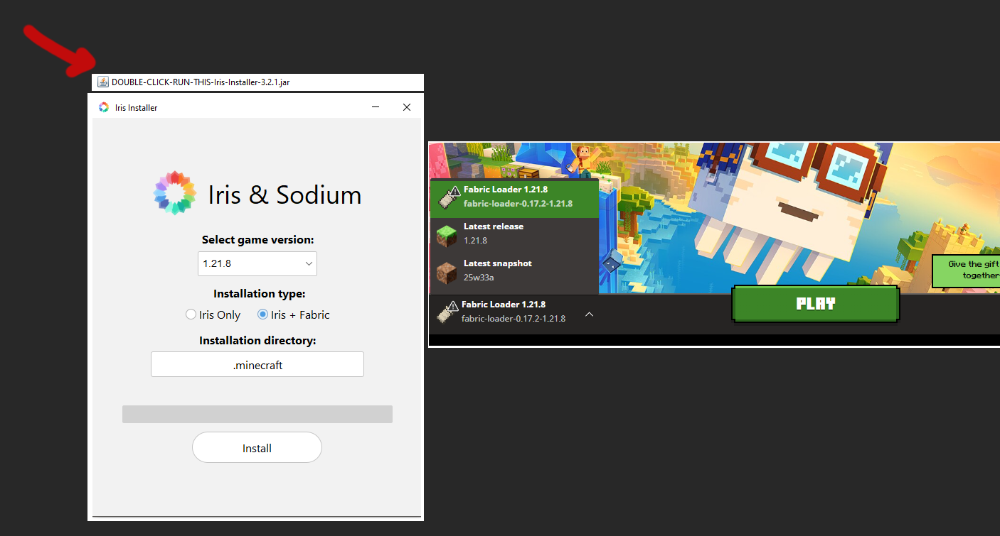
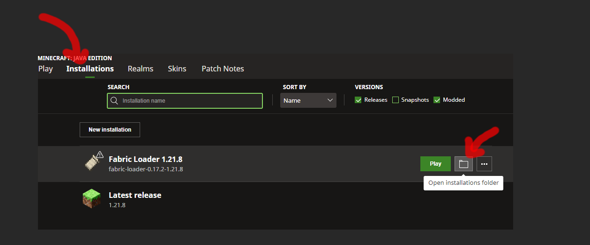
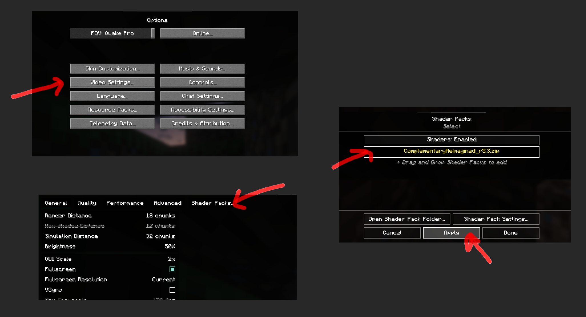
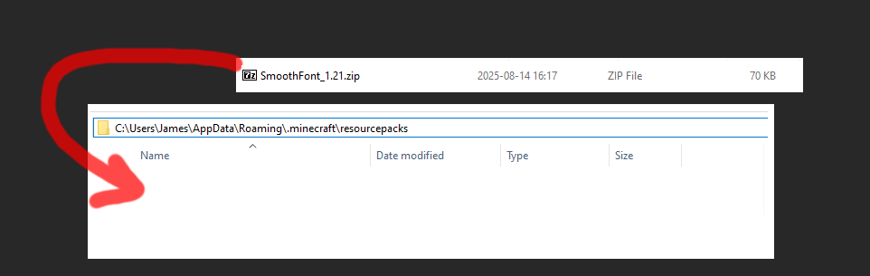
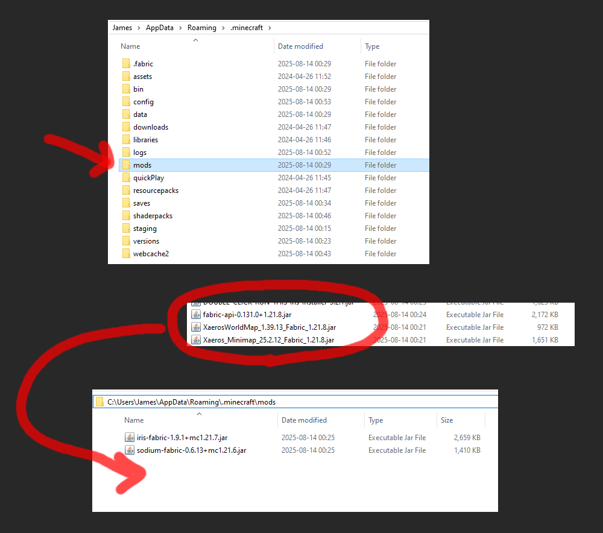

# mc-setup-1-21-8

picked by cabbagecanfly • 2025-08-14

client-side mod stuff.

**minecraft version 1.21.8**

## launcher

- iris/sodium fabric launcher  
https://www.irisshaders.dev/download  

## shaders

**optional**

- complementary shader (manual zip file)  
https://www.curseforge.com/minecraft/shaders/complementary-unbound/files/6515579  

## resource packs

**optional**

- smooth font  
https://www.curseforge.com/minecraft/texture-packs/smooth-font/files/5623665  

---

## mods

**required**

fabric api
- https://www.curseforge.com/minecraft/mc-mods/fabric-api/files/6842969    

**map**

- map mods by xaeros  
https://www.curseforge.com/minecraft/mc-mods/xaeros-world-map/files/6786828  
https://www.curseforge.com/minecraft/mc-mods/xaeros-minimap/files/6802273  

**highly recommended**

- mod menu  
https://www.curseforge.com/minecraft/mc-mods/modmenu/files/6676751  

- common mod requirements (cloth config, YACL, kotlin)  
https://www.curseforge.com/minecraft/mc-mods/cloth-config/files/6669836  
https://www.curseforge.com/minecraft/mc-mods/yacl/files/6662860  

- controlling mod (keybind search)  
https://www.curseforge.com/minecraft/mc-mods/searchables/files/6805197  
https://www.curseforge.com/minecraft/mc-mods/controlling/files/6808740  

- jade mod (shows item info in hud)  
https://www.curseforge.com/minecraft/mc-mods/jade/files/6874217  

**recommended**

- mouse tweaks mod (scroll wheel and shift click in inventory)  
https://www.curseforge.com/minecraft/mc-mods/mouse-tweaks/files/6665313  

- inventory sort mod  
https://www.curseforge.com/minecraft/mc-mods/modmenu/files/6676751  
https://www.curseforge.com/minecraft/mc-mods/cloth-config/files/6669836  
https://www.curseforge.com/minecraft/mc-mods/lightweight-inventory-sorting/files/6683465  

- item recipe mod  
https://www.curseforge.com/minecraft/mc-mods/cloth-config/files/6669836  
https://www.curseforge.com/minecraft/mc-mods/architectury-api/files/6803290  
https://www.curseforge.com/minecraft/mc-mods/roughly-enough-items/files/6833148  

- zoom mod  
https://www.curseforge.com/minecraft/mc-mods/yacl/files/6662860  
https://www.curseforge.com/minecraft/mc-mods/fabric-language-kotlin/files/6688121  
https://www.curseforge.com/minecraft/mc-mods/zoomify/files/6667177  

- replanter mod  
https://modrinth.com/mod/replanter-plus/version/2.3.2-1.21.6  

- bridging mod (allows placing blocks in front, below, etc.)  
*beware using it in big servers that might ban this*  
https://www.curseforge.com/minecraft/mc-mods/yacl/files/6662860  
https://www.curseforge.com/minecraft/mc-mods/bridging-mod/files/6674770  

- sign tools mod  
https://www.curseforge.com/minecraft/mc-mods/sign-tools/files/5640377  

**optional**

- status effect bar mod  
https://www.curseforge.com/minecraft/mc-mods/status-effect-bars/files/6679490  

- chat heads mod  
https://www.curseforge.com/minecraft/mc-mods/cloth-config/files/6669836  
https://www.curseforge.com/minecraft/mc-mods/chat-heads/files/6670501  

- more chat history mod  
https://www.curseforge.com/minecraft/mc-mods/morechathistory/files/5286193  

- dynamic cursor mod  
https://www.curseforge.com/minecraft/mc-mods/yacl/files/6662860  
https://www.curseforge.com/minecraft/mc-mods/dynamic-crosshair/files/6779767  

- mini hud mod  
https://modrinth.com/mod/malilib/version/0.25.4  
https://modrinth.com/mod/minihud/version/0.36.3  

- better mount hud  
https://www.curseforge.com/minecraft/mc-mods/better-mount-hud/files/6679741  

- fabrishot (large resolution screenshot - press f9)  
https://www.curseforge.com/minecraft/mc-mods/fabrishot/files/6830775  

- dark loading screen  
https://modrinth.com/mod/dark-loading-screen/version/1.6.17  
